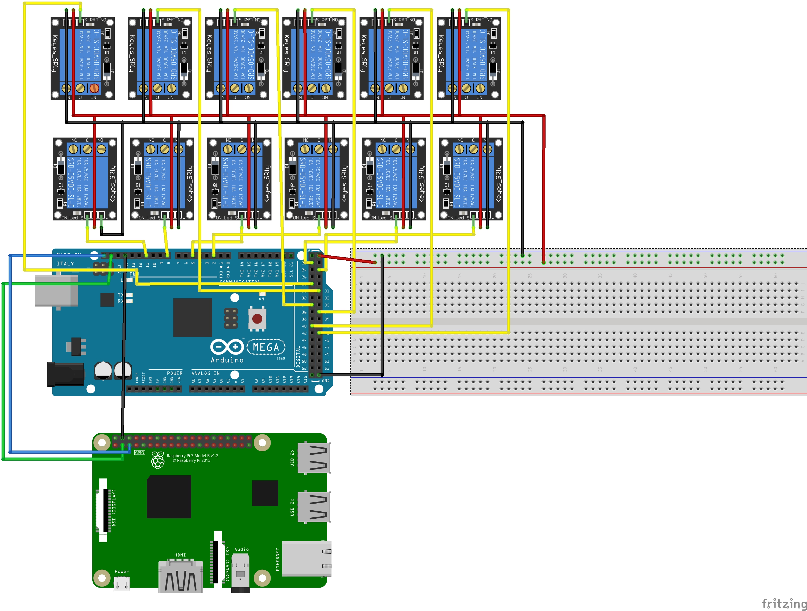

# Proyecto para automatizar las luces de tu casa 

## EL HARDWARE

En el caso del material requerido para esta ocasión va a cambiar mucho para cada escenario. Lo siguiente es lo adecuado.

- Un módulo relay para cada luz que vas a controlar  
- Un Arduino Mega (puedes usar otros modelos, recomiendo este solo por los pines).  
- Un LED RGB por cada luz  
- Un protoboard, entre más grande, mejor.

## La conexión

Para la configuración de este proyecto debes conectar los dispositivos de la siguiente manera.



Sé muy bien que guiarte con una imagen de este tipo sería demasiado complejo. Por lo mismo, he subido el esquema de fritzing de manera editable para que te sea más cómodo poder modificar la visualización y puedas ver a detalle que es lo que el sistema hace.

Puedes ver el diagrama de Fritzing en esta [ruta]("https://github.com/aminespinoza/Control-casa/blob/master/Hardware/Assets/DiagramaCasa.fzz").

Recuerda que la configuración se modificará en función de la cantidad de luces que quieras tener activas.

## El código de Arduino

Dentro de la carpeta de [ControlLuces]("https://github.com/aminespinoza/Control-casa/tree/master/Hardware/ControlLuces") podrás encontrar la aplicación para Arduino que se encarga de controlar los relevadores que a su vez controlarán las luces. Hay varias observaciones que debes tener aquí.  
Lo primero es la declaración de las variables iniciales.

```c
int relayOne = 2, redLedLightOne = 3, greenLedLightOne = 4;
int relayTwo = 5, redLedLightTwo = 6, greenLedLightTwo = 7;
int relayThree = 8, redLedLightThree = 9, greenLedLightThree = 10;
int relayFour = 11, redLedLightFour = 12, greenLedLightFour = 13;
int relayFive = 14, redLedLightFive = 15, greenLedLightFive = 16;
int relaySix = 17, redLedLightSix = 18, greenLedLightSix = 19;
int relaySeven = 20, redLedLightSeven = 21, greenLedLightSeven = 22;
int relayEight = 23, redLedLightEight = 24, greenLedLightEight = 25;
int relayNine = 26, redLedLightNine = 27, greenLedLightNine = 28;
int relayTen = 29, redLedLightTen = 30, greenLedLightTen = 31;
int relayEleven = 32, redLedLightEleven = 33, greenLedLightEleven = 34;
int relayTwelve = 35, redLedLightTwelve = 36, greenLedLightTwelve = 37;
```
Por cada luz debes declarar un renglón de este tipo, el primer valor corresponde al pin de Arduino donde deberás colocar el relevador de corriente, el segundo valor donde deberás colocar el ánodo rojo del LED, el tercer valor donde deberás colocar el ánodo verde del LED.  

```c
String data = "";
char charBuf[4];
```
Hay dos variables globales declaradas después de la función de **setup** y serán las que manejen y reciban los datos recibidos desde el puerto serial. Después, en la función **loop** verás que solo se trata de recibir un dato del puerto serial y si hay información recibida se ejecutará un método para manejar la luz adecuada. Observa que uso un método llamado **strcpy** que convierte el arreglo char* a un arreglo char.
```c
void loop()
{
  if(Serial.available()>0)
  {
    data = Serial.readString();
    Serial.println(data);
    char* charArray = data.c_str(); 
    strcpy(charBuf, charArray);
  }
  
  handleLightFromValue(charBuf[0], charBuf[1], charBuf[3]);
  delay(1000);
}
```
El método **handleLightFromValue** recibe los dos primeros datos como el número de la luz que va a manipular y el tercer dato como el estado donde 0 corresponde a apagado y 1 a encendido.
```c
void handleLightFromValue(char lightPosition, char lightSecondPosition, char lightValue)
{
  String stringValue = String(lightPosition) + String(lightSecondPosition);
  int finalValue = stringValue.toInt();
  
  switch (finalValue)
  {
    case 1:
      ShowSpecificColor(lightValue, redLedLightOne, greenLedLightOne, relayOne);
      break;
    case 2:
      ShowSpecificColor(lightValue, redLedLightTwo, greenLedLightTwo, relayTwo);
      break;
    case 3:
      ShowSpecificColor(lightValue, redLedLightThree, greenLedLightThree, relayThree);
      break;
    case 4:
      ShowSpecificColor(lightValue, redLedLightFour, greenLedLightFour, relayFour);
      break;
    case 5:
      ShowSpecificColor(lightValue, redLedLightFive, greenLedLightFive, relayFive);
      break;
    case 6:
      ShowSpecificColor(lightValue, redLedLightSix, greenLedLightSix, relaySix);
      break;
    case 7:
      ShowSpecificColor(lightValue, redLedLightSeven, greenLedLightSeven, relaySeven);
      break;
    case 8:
      ShowSpecificColor(lightValue, redLedLightEight, greenLedLightEight, relayEight);
      break;
    case 9:
      ShowSpecificColor(lightValue, redLedLightNine, greenLedLightNine, relayNine);
      break;
    case 10:
      ShowSpecificColor(lightValue, redLedLightTen, greenLedLightTen, relayTen);
      break;
    case 11:
      ShowSpecificColor(lightValue, redLedLightEleven, greenLedLightEleven, relayEleven);
      break;
    case 12:
      ShowSpecificColor(lightValue, redLedLightTwelve, greenLedLightTwelve, relayTwelve);
      break;
    default:
    break;
  }
}
```
En cualquier caso, un último método se invocará pero con los datos de variables adecuados.
```c
void ShowSpecificColor(int lightStatus, int redLight, int greenLight, int relayNumber)
{
  if(lightStatus == '1')
  {
    digitalWrite(relayNumber, LOW);
    digitalWrite(redLight, HIGH);
    digitalWrite(greenLight, LOW);
  }
  else if(lightStatus == '0')
  {
    digitalWrite(relayNumber, HIGH);
    digitalWrite(redLight, LOW);
    digitalWrite(greenLight, HIGH);
  }
}
```
Es un proceso sumamente fácil. Además hacemos que Arduino funcione como una tarjeta meramente transaccional, que solo gestiona los relevadores basándose en la información recibida por el puerto serial.

## Las pruebas

Debido a que este es el primer paso del proyecto y quizá el más delicado como fuente de errores debido a las soldaduras, arreglo de pines, etcétera. Antes de continuar, te recomiendo muchísimo no avanzar hasta hacer una prueba muy sencilla. Ingresa en el monitor serial datos como 01,1 o 01,0 y deberás ver que el relevador ubicado en esta posición se encienda o apague. 

 

Es una prueba muy fácil y que te permitirá comprobar que ya tienes todo listo para continuar con el proceso. Después de todo esto, podrás comenzar ya con la aplicación de WPF que recibirá toda la información y la enviará por COM a Arduino.


