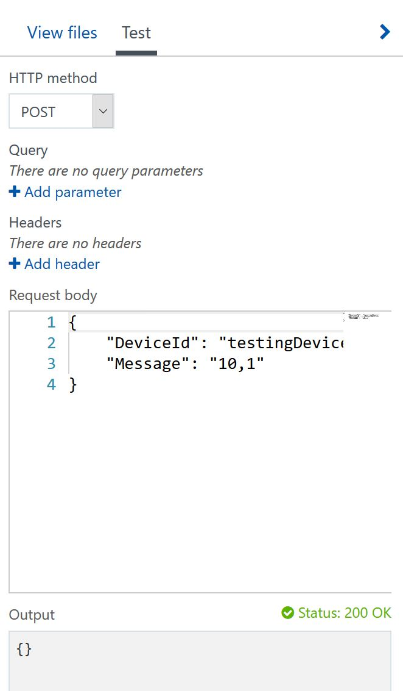

# Configuración de la infraestructura

## Azure IoT Hubs

Obviamente usaré mi característica favorita de Azure para todo esto. Voy a crear un IoT Hub. No explicaré mucho de esto porque tengo otros repositorios que lo hacen a la perfección.  
Si no conoces de IoT Hub, quizá puedes empezar por hacer [este ejemplo](https://github.com/aminespinoza/Ejercicio-1-IoT-Hub-y-Windows-10).

Para este ejercicio solo debes extraer la cadena de conexión del IoT Hub, esta cadena de conexión la podrás utilizar para el [Device Explorer](https://github.com/Azure/azure-iot-sdk-csharp/tree/master/tools/DeviceExplorer) y para la aplicación WPF.


Con la cadena de conexión podrás crear nuevos dispositivos y tendrás la posibilidad de copiar la cadena de conexión de alguno de estos para usarla dentro de la Aplicación Universal de Windows.


Antes de que la aplicación del dispositivo móvil o el bot comiencen a enviar información, puedes hacerlo desde la pestaña de entonces podrás ver reflejado en este explorador de dispositivos la información enviada desde la pestaña de **Messae to Device**.


En el caso del bot, hay un par de consideraciones que debes tener presente. La primera es que no puedes instalar el SDK del IoT Hub de manera directa en un proyecto de este tipo por incompatibilidad en el proceso de información, la segunda es que no puedes utilizar el API REST del IoT para enviar mensajes D2C a tus dispositivos. 

El resultado de esto fue implementar una Azure Function con el siguiente código.
```csharp
Message.csx

public class DeviceMessage 
{
	public string DeviceId {get;set;}
	public string Message {get;set;}
}
```

```json
project.json

{
    "frameworks": {
        "net46": {
            "dependencies": {
                "Microsoft.Azure.Devices": "*"
            }
        }
    }
}
```
```csharp
Run.csx

#r "Newtonsoft.Json"
#load "Message.csx"

using System;
using Microsoft.Azure.Devices;
using Newtonsoft.Json;
using System.Text;
using System.Configuration;
using System.Net;

public static async Task Run(string req, TraceWriter log)
{
    log.Info($"Function received a D2C message: {req}");

    var parsedMessage = JsonConvert.DeserializeObject<DeviceMessage>(req);
    log.Info($"device id: {parsedMessage.DeviceId}");

    var connnectionString = "cadena de conexion IoT Hub";
    var serviceClient = ServiceClient.CreateFromConnectionString(connnectionString);
    var commandMessage = new Message(Encoding.ASCII.GetBytes(parsedMessage.Message));
    
    log.Info($"sending message");
    await serviceClient.SendAsync(parsedMessage.DeviceId, commandMessage);
}
```

Con todo esto ya listo entonces tendrás la capacidad de envíar vía REST por medio de un cuerpo de mensaje todos los mensajes que quieras al dispositivo de control de luces.



La parte de infraestructura hasta ahora es simple, con el avance del proyecto irá expandiéndose cada vez más, por ahora con esto tendrás todo listo para tu solución.


