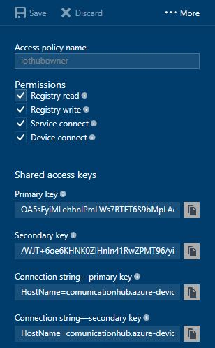
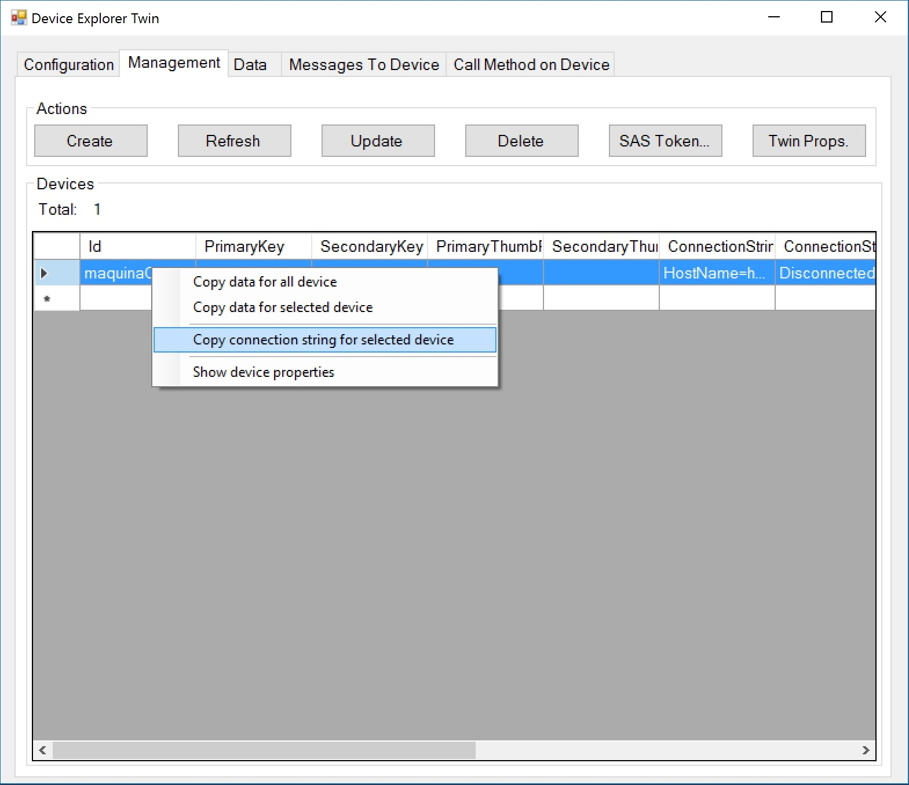
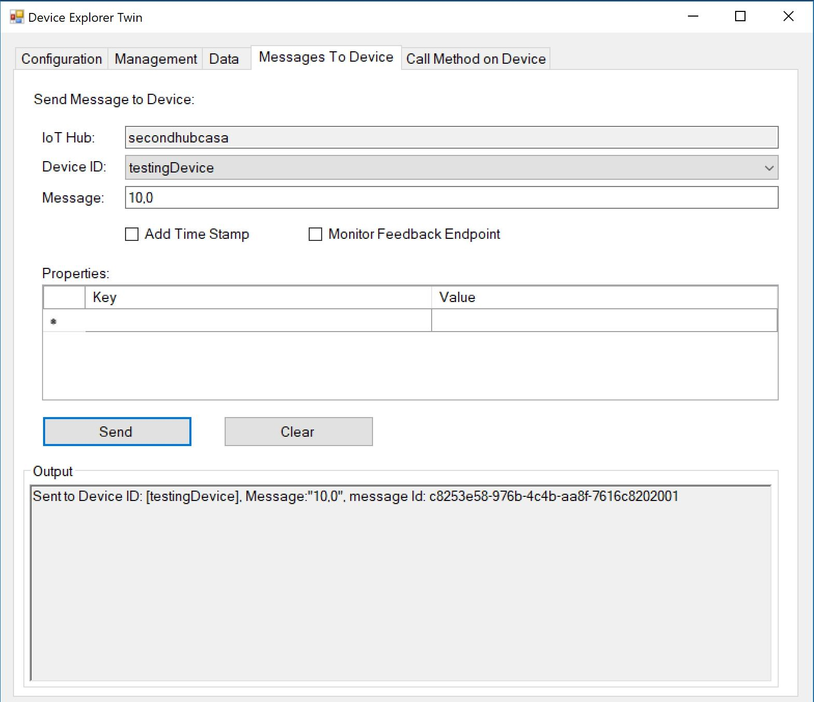

# Configuración de la infraestructura

## Azure IoT Hubs

Obviamente usaré mi característica favorita de Azure para todo esto. Voy a crear un IoT Hub. No explicaré mucho de esto porque tengo otros repositorios que lo hacen a la perfección.  
Si no conoces de IoT Hub, quizá puedes empezar por hacer [este ejemplo](https://github.com/aminespinoza/Ejercicio-1-IoT-Hub-y-Windows-10).

Para este ejercicio solo debes extraer la cadena de conexión del IoT Hub, esta cadena de conexión la podrás utilizar para el [Device Explorer](https://github.com/Azure/azure-iot-sdk-csharp/tree/master/tools/DeviceExplorer) y para la aplicación WPF.

Con la cadena de conexión podrás crear nuevos dispositivos y tendrás la posibilidad de copiar la cadena de conexión de alguno de estos para usarla dentro de la Aplicación Universal de Windows.

Cuando la aplicación UWP esté lista y funcionando entonces podrás ver reflejado en este explorador de dispositivos la información enviada desde la pestaña de **Data**.

La parte de infraestructura hasta ahora es simple, con el avance del proyecto irá expandiéndose cada vez más, por ahora con esto tendrás todo listo para tu solución.

