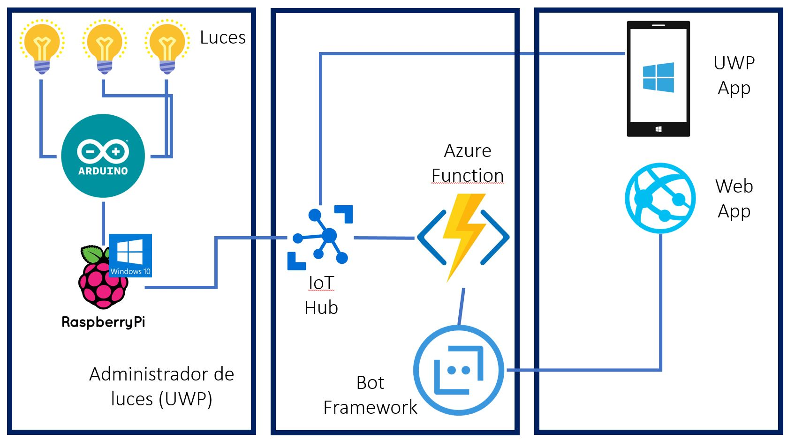
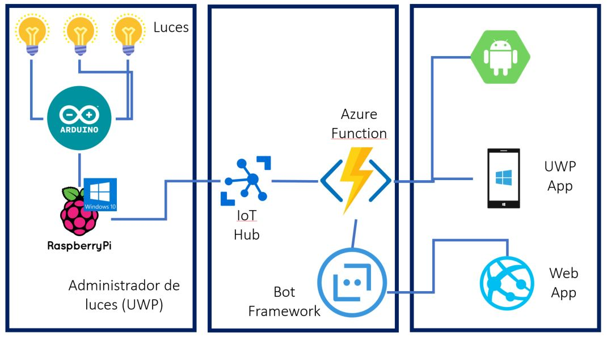

# Proyecto para automatizar las luces de tu casa

Para hacer más fácil la navegación he dividido el proyecto en tres secciones.

La sección de [Hardware](https://github.com/aminespinoza/Control-casa/tree/master/Hardware) te explicará acerca del cableado, estructura de Arduino y el desarrollo de ese proyecto.  
La sección de [Infraestructura](https://github.com/aminespinoza/Control-casa/tree/master/Infraestructura) describe todo lo hecho en Azure para configurar todo lo que comunicará a todas las aplicaciones.  
La sección de [Software](https://github.com/aminespinoza/Control-casa/tree/master/Software) abarcará el desarrollo de la aplicación que se comunicará con Arduino y además todos los clientes hechos bajo diferentes plataformas.

Si quieres conocer un poco más acerca de este proyecto, te invito a leer el artículo que escribí en mi blog.

## Actualizaciones al proyecto

## Commit 15

El proyecto ha sido rediseñado por completo. Los leds se ha eliminado y hemos reemplazado la PC, ahora la máquina es una Raspberry Pi 3 basada en Windows 10 IoT Core, no se utiliza la telemetría sino el envío de mensajes. Todas las secciones cuentan con la nueva configuración.

## Arquitectura de la aplicación

En un caso se trata de una aplicación de tipo UWP que es capaz de comunicarse directamente con el IoT Hub encargado de enviar los mensajes a la aplicación administrador también de tipo UWP pero hospedada en una Raspberry Pi 3.

Por otro lado, un bot que por medio de un web site tendrá la capacidad de enviar los mismos mensajes pero gracias a una Azure Function que será la encargada de manejarlos.

En las tres secciones encontrarás todo lo necesario para poder trabajar en este proyecto.

## Commit 16

Los botones de luz en la Raspberry cambian ya su estado dependiendo del estado de la luz.
Se agregó un nuevo control de usuario en la aplicación cliente para eliminar el uso de botones y visualizar el estado de cada luz.

## Commit 18

**Xamarin is in the house!!!!!**  
Se eliminó el uso del SDK de IoT en la aplicación cliente UWP, ahora todos los clientes (bot, Android y UWP) envían los mensajes por medio de Azure Functions.

@aminespinoza
