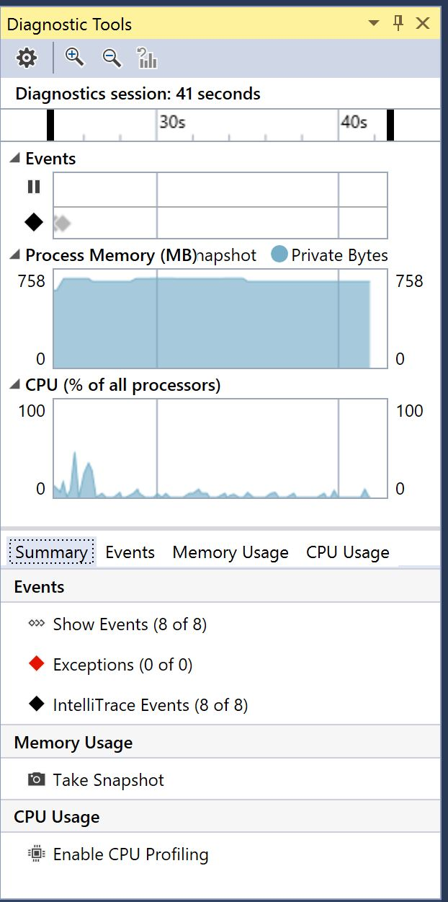

# Proyecto para automatizar las luces de tu casa

Para hacer más fácil la navegación he dividido el proyecto en tres secciones.

La sección de [Hardware](https://github.com/aminespinoza/Control-casa/tree/master/Hardware) te explicará acerca del cableado, estructura de Arduino y el desarrollo de ese proyecto.  
La sección de [Infraestructura](https://github.com/aminespinoza/Control-casa/tree/master/Infraestructura) describe todo lo hecho en Azure para configurar todo lo que comunicará a todas las aplicaciones.  
La sección de [Software](https://github.com/aminespinoza/Control-casa/tree/master/Software) abarcará el desarrollo de la aplicación que se comunicará con Arduino y además todos los clientes hechos bajo diferentes plataformas.

Si quieres conocer un poco más acerca de este proyecto, te invito a leer el artículo que escribí en mi blog.

## Actualizaciones al proyecto

A partir del [Commit 8](https://github.com/aminespinoza/Proyecto-Miranda/commit/74567a1d7eaab58b1d0450f33ab600b73b789dfc) de este proyecto comenzaré a agregar nueva funcionalidad en las aplicaciones, no tengo idea de que podré ir agregando pero veremos que va saliendo.

En este [Commit 8](https://github.com/aminespinoza/Proyecto-Miranda/commit/74567a1d7eaab58b1d0450f33ab600b73b789dfc) agregué lo siguiente:  
- Una intefaz a la aplicación WPF con una imagen tecnológica.
- Un menú de navegación (Index Menu) que servirá para crear cualquier tipo de nuevas ventanas.
- La funcionalidad de arrastrar ventanas gracias al control [DragCanvas](https://www.codeproject.com/Articles/15354/Dragging-Elements-in-a-Canvas) de Josh Smith
- La funcionalidad de reproducir archivos GIF gracias al paquete libre [WpfAnimatedGif](https://github.com/XamlAnimatedGif/WpfAnimatedGif) donde puedes ver a dos nuevas ventanas reproduciendo imágenes de este tipo.  

**Observaciones de este proyecto**  
En este proyecto hay un gran problema de rendimiento en la memoria RAM, la biblioteca de clases WpfAnimatedGif incrementa exponencialmente la RAM, hasta ahora el proyecto se incrementa desde 60 MB sin implementar esta clase, hasta los 755 MB solo por dos animaciones, utilicé una animación alta definición (1920x1080) y el consumo se fue hasta los 4 GB.

Pensaba poner muchas imágenes y ventanas de este tipo pero este gran problema me detuvo. Hasta no encontrar otra opción o ver como optimizar las cosas solo habrá dos ventanas.

@aminespinoza
