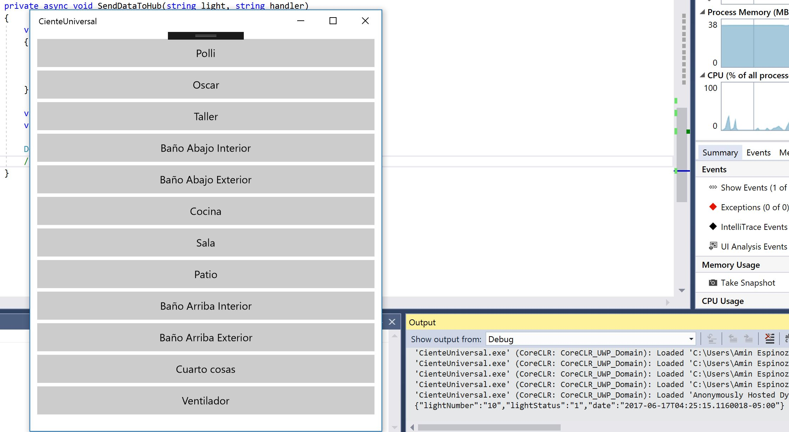

# Aplicaciones cliente UWP y administrador WPF

En esta sección tengo dos proyectos. El primero corresponde a una aplicación WPF que será el administrador y quien enviará la información a Arduino. El segundo proyecto corresponde a una aplicación cliente para UWP que será la que envíe la infromación a la nube y de ahí la aplicación administrador recibirá la información.

## Aplicación administrador (hecha con WPF)

La aplicación para la administración de las luces desde el equipo es sumamente fácil, de hecho, hasta este último [commit](https://github.com/aminespinoza/Control-casa/commit/3ea3b78c247193a45440ba186134d67641357257) la aplicación no cuenta con una interfaz en lo absoluto, simplemente recibe la información desde Azure, la procesa y envía a Arduino. La intención es que paulatinamente pueda agregar cosas nuevas aquí para expandir la funcionalidad.

Por ahora, lo único que vale la pena ver de este proyecto es lo siguiente:  
En primer lugar establece el nombre del puerto por medio del cuál te vas a comunicar con Arduino así como el baudrate que usarás.
```c
string portName = "COM4";
puertoSerial.PortName = portName;
puertoSerial.BaudRate = 9600;
```
Después, nota que establecerás la comunicación con el IoT Hub por medio de los valores siguientes. El número **3** dentro del método CreateReceiver tiene que ver con el partitionId de IoT Hub, para poder saber cuantos tienes y cuál se usa está la línea siguiente. Las opciones son pocas y puedes llegar por descartamiento. Por último un temporizador que obviamente estará cada segundo viendo si se encuentra algún nuevo mensaje ya disponible.
```c
serviceClient = ServiceClient.CreateFromConnectionString(connectionString);

eventHubClient = EventHubClient.CreateFromConnectionString(connectionString, iotHubD2cEndpoint);
eventHubReceiver = eventHubClient.GetDefaultConsumerGroup().CreateReceiver("3", DateTime.UtcNow);

var d2cPartitions = eventHubClient.GetRuntimeInformation().PartitionIds;

timer = new DispatcherTimer();
timer.Interval = TimeSpan.FromSeconds(1);
timer.Tick += Timer_Tick;
timer.Start();
```
El temporizador solo desencadena el evento **HandleReceivedInformation** que obtendrá la información del IoT Hub y después lo procesará usando serialización de JSON para los dos primeros valores que ocupamos.
```c
private async Task HandleReceivedInformation()
{
	EventData eventData = await eventHubReceiver.ReceiveAsync();
	string data = Encoding.UTF8.GetString(eventData.GetBytes());

	JObject serializedObject = JObject.Parse(data);
	string lightNumber = serializedObject["lightNumber"].ToString();
	string lightStatus = serializedObject["lightStatus"].ToString();
	DateTime lastMove = Convert.ToDateTime(serializedObject["date"]);

	HandleLights(lightNumber, lightStatus);
}
```
El método final, llamado HandleLights solo recibe el texto, lo formatea de la manera esperada, abrirá el puerto y después envía el texto para que por último solo cierre el puerto. Esta parte es de gran importancia puesto que mantener el puerto abierto de manera permanente solo hará que la conexión colapse y la aplicación deje de funcionar sin emitir ningún error lo que dificultará mucho poder ubicar el problema de manera veloz. Entre menos operaciones se hagan con el puerto abierto será mucho mejor, es por eso que solo se hará la única indispensable que es escribir sobre el mismo puerto. Como ventaja adicional encontré que esto también mantiene en buen estado el consumo de memoria RAM de la aplicación, si abrimos el puerto todo el tiempo la memoria se incrementa paulatinamente hasta un 50 por ciento.
```c
private void HandleLights(string light, string status)
{
	string finalCommand = string.Format("{0},{1}", light, status);

	puertoSerial.Open();
	puertoSerial.Write(finalCommand);
	puertoSerial.Close();
}
```
Hasta aquí es todo lo que la aplicación de WPF hace por el momento. Considera que esta aplicación, por ser el administrador, será en la que más trabajaremos y en la que más cambios iremos viendo en todo momento.

## La aplicación cliente UWP

El segundo proyecto dentro de esta solución es una Aplicación Universal de Windows y es simplemente un conjunto de doce botones que corresponden a cada una de las luces presentadas.


Cada botón ejecuta el mismo método solo que obviamente con cada una de sus variables.
```c
private void btnTaller_Click(object sender, RoutedEventArgs e)
{
	HandleLightStatus("10", ref luzTallerPrendida);
}
```
Este método llamado **HandleLightStatus** solo fue creado para ser un punto medio antes de subir información a la nube. El método que sube información al IoT Hub es de tipo asíncrono y por la naturaleza del mismo no es posible usar parámetros con referencia de valores y esto es sumamente útil para mantener el estado de cada luz dentro de la aplicación así que crear dos métodos fue la mejor solución, además, así cumplimos la premisa de que cada método debe llevar una sola función.
```c
private void HandleLightStatus(string light, ref bool handler)
{
	if (handler)
	{
		SendDataToHub(light, "0");
	}
	else
	{
		SendDataToHub(light, "1");
	}

	handler = !handler;
}
```
El método **SendDataToHub** recibe los parámetros esperados para crear una cadena con formato JSON que será la que se envíe al IoT Hub, solo para validar que todo va en orden, la misma cadena se imprime en la terminal de salida de Visual Studio.
```c
private async void SendDataToHub(string light, string handler)
{
	var telemetryDataPoint = new
	{
		lightNumber = light,
		lightStatus = handler,
		date = DateTime.Now
	};

	var messageString = JsonConvert.SerializeObject(telemetryDataPoint);
	var message = new Message(Encoding.ASCII.GetBytes(messageString));

	Debug.WriteLine(messageString);
	await deviceClient.SendEventAsync(message);
}
```
## Las pruebas

La primera prueba que debes ver aquí es comprobar que en la terminal de salida de Visual Studio se imprime un texto en formato JSON como el siguiente.
```c
{"lightNumber":"10","lightStatus":"1","date":"2017-06-17T04:25:15.1160018-05:00"}
```


La segunda prueba es que usando el [Device Explorer](https://github.com/Azure/azure-iot-sdk-csharp/tree/master/tools/DeviceExplorer) para IoT Hub puedas ver que si estás enviando la información a la nube, obviamente esta prueba la podrás hacer únicamente después de la configuración de toda tu infraestructura en la última seccion.

Con respecto a la aplicación de WPF, puedes escribir en el método **HandleLights** por un momento un poco de código **hardcoded** que pueda funcionar de la siguiente manera.
```c
private void HandleLights(string light, string status)
{
	string finalCommand = "01,1";

	puertoSerial.Open();
	puertoSerial.Write(finalCommand);
	puertoSerial.Close();
}
```
Hacer esto te hará comprobar que la comunicación entre WPF y Arduino está sucediendo de la manera esperada y que podrás avanzar sin problemas hasta aquí. 

También, en la aplicación WPF debes asignar el puerto COM, este puerto lo puedes obtener desde la aplicación de Arduino (te aparece en la configuración del puerto), también asegúrate de que no tengas abierto el monitor serial de Arduino pues toma control del puerto y solo puede haber un enlace, ya sea la aplicación WPF o el monitor serial de Arduino, así que no tengas nada abierto que utilice este puerto para evitar errores.
