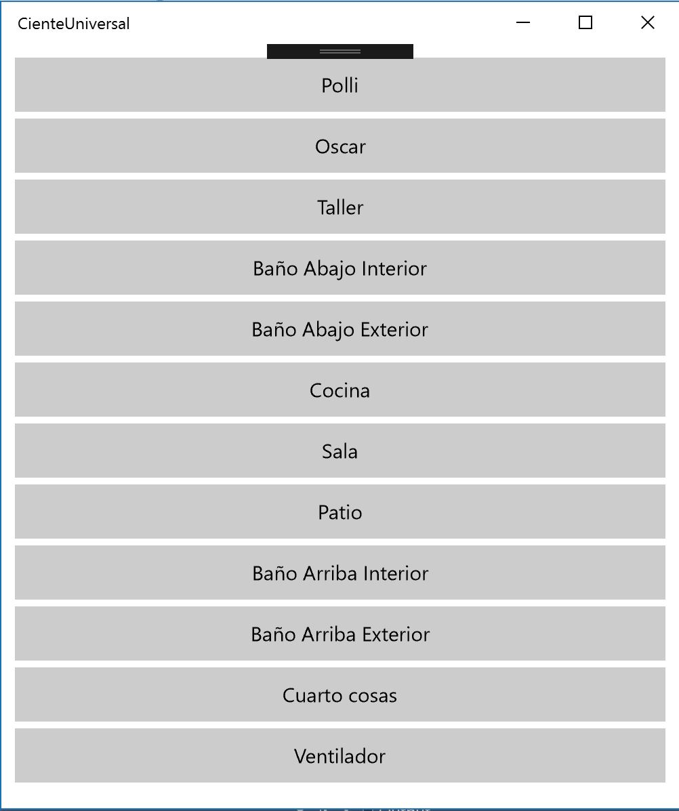

# Aplicaciones cliente UWP y administrador UWP

En esta sección tengo tres proyectos proyectos, todos dentro de una misma solución en Visual Studio.

Los proyectos son los siguientes:

- Un bot que es capaz de enviar mensajes al dispositivo por medio de una Azure Function.
- Un cliente hecho con UWP capaz de enviar mensajes al dispositivo por medio de IoT Hub.
- Un administrador capaz de recibir los mensajes que IoT Hub le envía y procesarlos para encender o apagar luces.


## La aplicación administrador UWP

El administrador de todas las luces y quien se conecta de manera directa a Arduino es una aplicación UWP que muestra en pantalla la siguiente interfaz.

--Foto de como luce el sistema--

Los botones desplegados en esta aplicación son **User controls** y se utilizan para reflejar el estado de cada luz por medio de una propiedad llamada **isLightOn**.
```csharp
public bool IsLightOn
{
	get { return isLightOn; }
	set { isLightOn = value; NotifyPropertyChanged("IsLightOn"); }
}
```

El resultado de todo esto es reflejado gracias a un convertidor llamado **LightConverter** (muy ocurrente el nombre ¿no?).
```csharp
public object Convert(object value, Type targetType, object parameter, string language)
{
	bool isDecided = (bool)value;

	if (isDecided)
	{
		return new SolidColorBrush(Color.FromArgb(255, 15, 106, 158));
	}
	else
	{
		return new SolidColorBrush(Color.FromArgb(51, 15, 106, 158));
	}
}
```

En Main Page podrás encontrar la comunicación por medio de I2C en el método **InitiateMonitoring**.
```csharp
private async void IniciateMonitoring()
{
	var settings = new I2cConnectionSettings(0x40);
	settings.BusSpeed = I2cBusSpeed.StandardMode;
	string aqs = I2cDevice.GetDeviceSelector();
	IReadOnlyList<DeviceInformation> devices = await DeviceInformation.FindAllAsync(aqs);
	bridgeDevice = await I2cDevice.FromIdAsync(devices[0].Id, settings);
}
```

Ahí mismo podrás ver el método que recibe el mensaje del IoT Hub y lo procesa para enviar a Arduino.
```csharp
private async void ReceiveMessage()
{
	while (true)
	{
		Message receivedMessage = await deviceClient.ReceiveAsync();
		if (receivedMessage == null) continue;
		Debug.WriteLine(Encoding.ASCII.GetString(receivedMessage.GetBytes()));

		await deviceClient.CompleteAsync(receivedMessage);
		bridgeDevice.Write(receivedMessage.GetBytes());
	}
}
```

## La aplicación cliente UWP

El segundo proyecto dentro de esta solución es una Aplicación Universal de Windows y es simplemente un conjunto de doce botones que corresponden a cada una de las luces presentadas.



Cada botón ejecuta el mismo método solo que obviamente con cada una de sus variables.
```csharp
private void btnTaller_Click(object sender, RoutedEventArgs e)
{
	HandleLightStatus("10", ref luzTallerPrendida);
}
```
Este método llamado **HandleLightStatus** solo fue creado para ser un punto medio antes de subir información a la nube. El método que sube información al IoT Hub es de tipo asíncrono y por la naturaleza del mismo no es posible usar parámetros con referencia de valores y esto es sumamente útil para mantener el estado de cada luz dentro de la aplicación así que crear dos métodos fue la mejor solución, además, así cumplimos la premisa de que cada método debe llevar una sola función.
```csharp
private void HandleLightStatus(string light, ref bool handler)
{
	if (handler)
		SendDataToHub(light, "0");
	else
		SendDataToHub(light, "1");

	handler = !handler;
}
```
El método **SendDataToHub** recibe los parámetros esperados para crear una cadena básica que será la que se envíe al IoT Hub, hasta este caso te podría ser posible utilizar la secciónn de Cloud to Device para hacer exactamente lo mismo que este método.
```csharp
private async void SendDataToHub(string light, string handler)
{
	string finalMessage = string.Format("{0},{1}", light, handler);
	var commandMessage = new Message(Encoding.ASCII.GetBytes(finalMessage));
	await serviceClient.SendAsync("testingDevice", commandMessage);
}
```

## El bot

Como proyecto adicional se encuentra la opción de controlar todas las luces por medio de un bot y esto implica ciertos temas importantes a considerar. 

Las consideraciones son:  
	- Usaremos tarjetas adaptables para controlar las luces pero este modelo aún no es enteramente productivo, puedes ver la matriz de opciones en [este enlace](https://docs.microsoft.com/en-us/adaptive-cards/get-started/bots#channel-status).
	- No hay una manera directa de que el bot pueda enviar información debido a que el SDK de C# IoT no es compatible con el modelo de comunicación serializable que se utiliza en el bot y tampoco es posible utilizar el API REST de IoT Hub debido a que por este medio no es posible aún enviar mensajes de tipo C2D, como consecuencia de esto es que implementamos una Azure Function que puedes ver en la sección de infraestructura.

Con estas consideraciones entonces podemos ya ver lo relevante del proyecto del bot.

Lo primero es que necesitas agregar el [paquete de Nuget](https://www.nuget.org/packages/AdaptiveCards/1.0.0-beta10) para tarjetas adaptables, este paquete está en modo *Pre release* pero funciona bastante bien. Es aquí donde puedes ver cómo invocar a la tarjeta adaptable por medio de un formato de JSON, esto hace las cosas mucho más funcionales debido a que de esta manera puedes utilizar el [visualizador](http://adaptivecards.io/visualizer/) para crear la tarjeta que desees y después solo invocarla sin problema.


```csharp
if (activity.Text.ToLower() == "arriba" || activity.Text.ToLower() == "abajo")
{
	string levelSelector = activity.Text;

	HttpClient client = new HttpClient();
	HttpResponseMessage response;
	AdaptiveCard card = new AdaptiveCard();
	response = await client.GetAsync(String.Format("http://aminespinoza.com/docs/tarjeta{0}.json", levelSelector));
	var json = await response.Content.ReadAsStringAsync();
	AdaptiveCardParseResult resultString = AdaptiveCard.FromJson(json);
	card = resultString.Card;
	IList<AdaptiveWarning> warnings = resultString.Warnings;


	Attachment attachment = new Attachment()
	{
		ContentType = AdaptiveCard.ContentType,
		Content = card
	};
	reply.Attachments.Add(attachment);
}
```

Después de haber probado con la tarjeta adaptable, podrás ver la manera de invocar a la Azure Function en donde como parámetros enviarás la luz y estado que deseas obtener y así la función se encargará de ejecutar el movimiento.
```csharp
private async void SendDataToFunction(string light, string handler)
{
	HttpClient request = new HttpClient();
	var requestedLink = new Uri("https://funcionescasa.azurewebsites.net/api/IotMessenger?code=bCnOkQEqLxiLYhkxZ4xXYXzTm7Wo9NwyOQuuhM/e1Jur0yVfGj0acw==");
	HttpRequestMessage requestMessage = new HttpRequestMessage(HttpMethod.Post, requestedLink);

	var sendString = String.Format("{{\"DeviceId\":\"testingDevice\",\"Message\":\"{0},{1}\"}}", light, handler);

	requestMessage.Content = new StringContent(sendString, Encoding.UTF8, "application/json");

	HttpResponseMessage response = await request.SendAsync(requestMessage);
	var responseString = await response.Content.ReadAsStringAsync();
}
```

Esto es hasta ahora todo lo que lleva este proyecto, puedes ver en la página principal todos los cambios que están por venir con cada nuevo commit.

